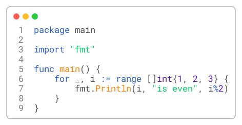
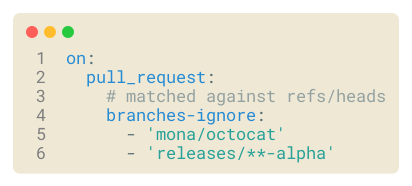
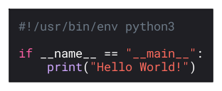

# ✂️ snippit

creates images of code snippets .

### Installation 
like any other go program:

```shell
go install github.com/juliusmh/snippit@latest
```

### General
The font used is RobotoMono. Currently, this is fixed. The default render resolution
is pretty low, given the default line height of 17. In order to increase resolution 
use the `-scale X` flag (default X=1). To see all available options use the `-help` flag.

Syntax highlighting is performed by [chroma](https://github.com/alecthomas/chroma).
For a list of all styles I recommend [xyproto/splash's demo page](https://xyproto.github.io/splash/docs/all.html).
For a list of all lexers checkout [chroma/lexers](https://github.com/alecthomas/chroma/tree/master/lexers).


### Configuration

```shell
snippit -l -w testdata/test.go 
```

- `-l` To show line numbers
- `-w` To show window



```shell
snippit -l -w -bw 0 -style solarized-light testdata/test.yaml 
```

- `-bw` **B**order **W**idth zero (hide border)
- `-style` Apply stylesheet `solarized-light`




```shell
snippit -br 0 -style xcode-dark testdata/test.py
```

- `-br` **B**order **R**adius zero 



### Upcoming

- Filename in window header (decoration)
- SVG output option