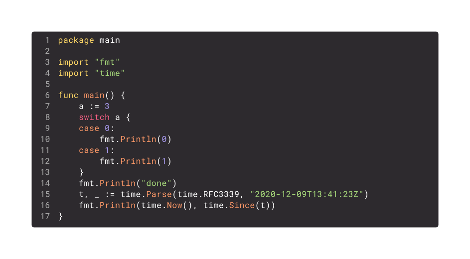
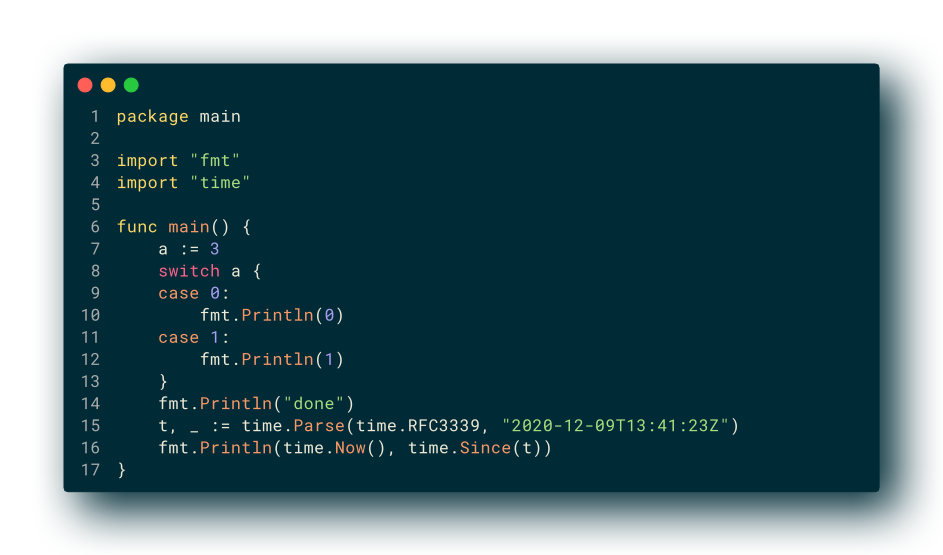
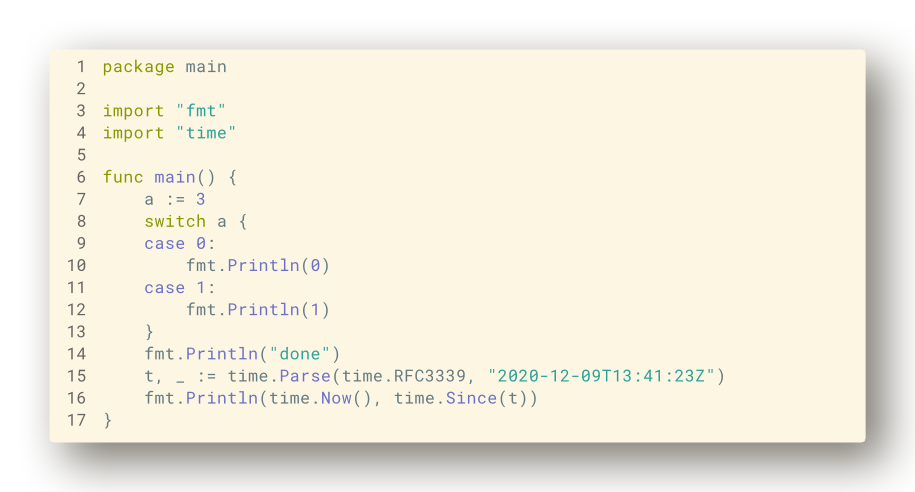

# snippit

creates syntax-highlighted code snippets in png or svg format.
Installation like any standard go program:

```sh
go install github.com/juliusmh/snippit@latest
```

The `snippit` binary reads input from `stdin`, unless a positional
parameter is passed. Reading a .go file from stdin:

```sh
cat main.go | snippit --syntax go --out snippet.png
```

Or running for a specific file:

```sh
snippit --syntax cpp --out snippet.svg src/main.cpp
```

### Supported themes
- monokai-dark
  
- solarized-dark
  
- solarized-light
  